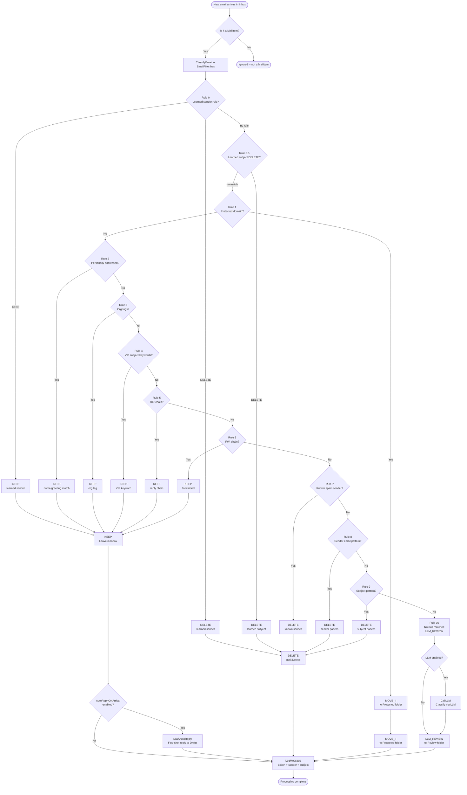
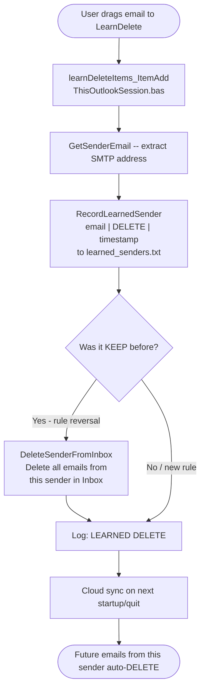
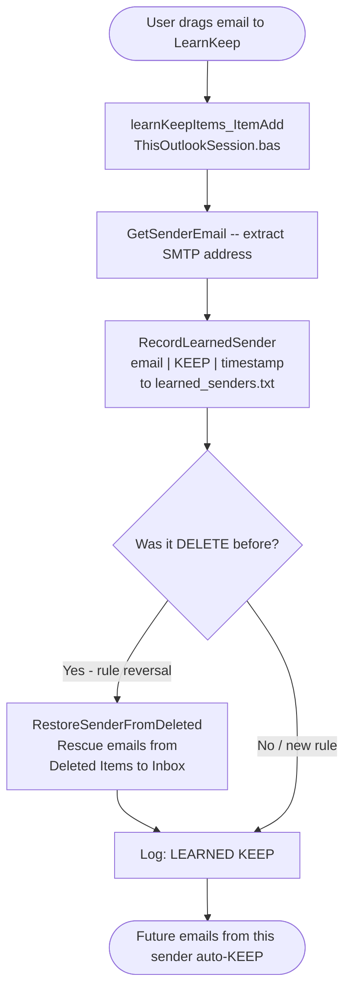
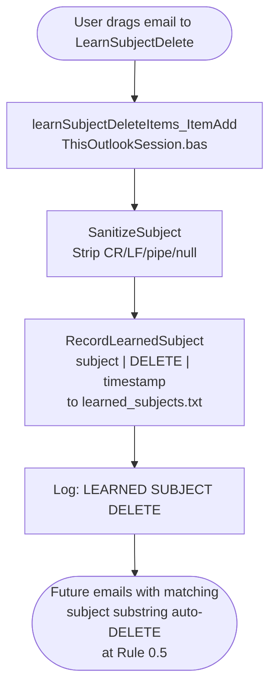
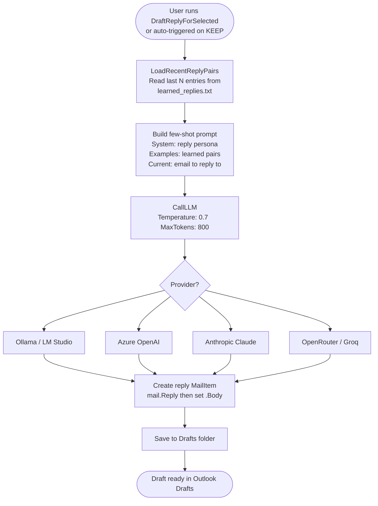
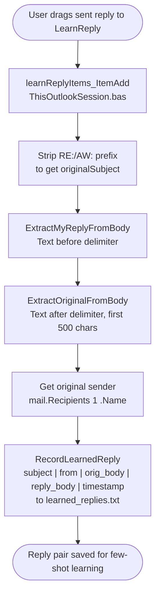

# Diagrams — Outlook Email Agent v3.0

All diagrams are authored in Mermaid (`.mmd` source) with pre-rendered `.svg` output.
The three diagrams in sections 1–3 below are also embedded inline so GitHub renders them directly on this page.

> **v3.1 note**: these diagrams show the v3.0 layout. Since then the command bridge moved
> from `Utilities.bas` into a dedicated `Bridge.bas`, and three modules were added
> (`AgentMemory.bas` — decision log/sender history, `EmailDigest.bas` — daily digest +
> rule mining, plus an `mcp/` server). The classification chain (Rules 0–10) is unchanged,
> except Rule 10's LLM step is now structured JSON with a confidence gate.

## Index

| Diagram | Source | Rendered | Description |
|---------|--------|----------|-------------|
| Full-system architecture | [architecture-full-system.mmd](architecture-full-system.mmd) | [SVG](architecture-full-system.svg) | Complete system: VBA modules, Web UI, data files, cloud sync, LLM providers |
| Email agent architecture | [architecture-email-agent.mmd](architecture-email-agent.mmd) | [SVG](architecture-email-agent.svg) | Module-level view: VBA module dependency chain + Web UI |
| Email arrival flow | [flow-email-arrival.mmd](flow-email-arrival.mmd) | [SVG](flow-email-arrival.svg) | Classification trace for a new email through the 10-rule chain |
| Classification chain | [activity-classification-chain.mmd](activity-classification-chain.mmd) | [SVG](activity-classification-chain.svg) | Compact activity view of the rule chain (Rules 0–10) |
| User action flows | [flow-user-actions.mmd](flow-user-actions.mmd) | [SVG](flow-user-actions.svg) | Learning flows A–E: learn KEEP/DELETE/subject rules, draft auto-reply, learn reply style |
| Command bridge sequence | [sequence-command-bridge.mmd](sequence-command-bridge.mmd) | [SVG](sequence-command-bridge.svg) | Web UI → Flask → JSON file bridge → VBA poller round trip |
| Email lifecycle states | [state-email-lifecycle.mmd](state-email-lifecycle.mmd) | [SVG](state-email-lifecycle.svg) | State diagram of an email from arrival through classification to final folder |

---

## 1. System Architecture

```mermaid
graph TB
    subgraph OUTLOOK["Microsoft Outlook Process"]
        direction TB

        subgraph EVENTS["ThisOutlookSession.bas -- Event Handlers Only"]
            STARTUP["Application_Startup\n1 LoadAllSettings\n2 StartCommandPollerStd\n3 Init folder watchers\n4 SyncLearnedRulesAuto"]
            INBOX_EVT["inboxItems_ItemAdd\nReal-time filter trigger"]
            LK_EVT["learnKeepItems_ItemAdd"]
            LD_EVT["learnDeleteItems_ItemAdd"]
            LS_EVT["learnSubjectDeleteItems_ItemAdd"]
            LR_EVT["learnReplyItems_ItemAdd"]
            QUIT["Application_Quit\nStopPoller + SyncAuto"]
        end

        subgraph CONFIG["Config.bas -- Constants and Variables Only"]
            DEFAULTS["DEFAULT_* constants\nCompile-time fallbacks"]
            RUNTIME["Runtime* variables\nLoaded from settings.ini"]
        end

        subgraph UTILS["Utilities.bas -- Shared Infrastructure"]
            direction LR
            STRING["String helpers\nContainsAny, StartsWithAny\nSanitizeSubject, Truncate"]
            LLM["CallLLM\nMulti-provider router"]
            IO["File I/O\nINI read/write\nLearned rules I/O\nReply pairs I/O"]
            ERR["Error handling\nPushCallStack\nLogError, LogMessage"]
            BRIDGE["Command Bridge\nSetTimer poller\nWriteResultFile"]
        end

        subgraph FILTER["EmailFilter.bas -- Classification Engine"]
            CLASSIFY["ClassifyEmail\n10-rule priority chain"]
            EXEC["ExecuteAction\nKEEP / DELETE /\nMOVE_II / LLM_REVIEW"]
            LLMWRAP["LLM Wrappers\nBuildEmailPrompt\nSummarizeSelectedEmail"]
        end

        subgraph AGENT["EmailAgent.bas -- AI Agent Features"]
            PATTERNS["GenerateAddressingPatterns"]
            REPLY["DraftAutoReply\nFew-shot reply engine"]
            SCAN["ScanSentForReplyPatterns"]
            DRAFT["DraftReplyForSelected"]
        end

        subgraph BATCH["BatchFilter.bas -- Batch Macros"]
            BATCHMAC["FilterExisting / FilterAllFolders\nFilterSelectedEmails\nFilterCurrentFolder\nFilterLastNDays\nDryRun / Report"]
        end
    end

    subgraph WEBUI["Web UI -- Python Flask localhost:5000"]
        direction TB
        SERVER["server.py\nFlask routes"]
        BRIDGEPY["bridge.py\nJSON command files"]
        SETTINGS["settings_manager.py\nINI read/write"]
        CHAT["chat.py\nKeyword to action parser"]
        SPA["static/\nindex.html + app.js\n6-tab SPA"]
    end

    subgraph STORAGE["Data Files -- %APPDATA%\OutlookEmailFilter"]
        INI["settings.ini"]
        SENDERS["learned_senders.txt"]
        SUBJECTS["learned_subjects.txt"]
        REPLIES["learned_replies.txt"]
        ERRORLOG["error.log"]
        CMDS["commands/*.json"]
    end

    subgraph CLOUD["Cloud Sync -- OneDrive"]
        CLOUDFILES["OutlookEmailFilter/\nlearned_senders.txt\nlearned_subjects.txt\nlearned_replies.txt"]
    end

    subgraph LLM_PROVIDERS["LLM Providers"]
        LOCAL["Ollama / LM Studio\nlocalhost OpenAI-compat"]
        AZURE["Azure OpenAI\napi-key auth"]
        CLAUDEAI["Anthropic Claude\nx-api-key auth"]
        OPENAI["OpenAI-compat\nOpenRouter, Groq, etc."]
    end

    STARTUP --> CONFIG
    STARTUP --> UTILS
    CONFIG --> UTILS
    UTILS --> FILTER
    UTILS --> AGENT
    FILTER --> BATCH
    AGENT --> BATCH
    INBOX_EVT --> CLASSIFY
    CLASSIFY --> EXEC
    BATCHMAC --> CLASSIFY

    LLM --> LOCAL
    LLM --> AZURE
    LLM --> CLAUDEAI
    LLM --> OPENAI

    IO --> INI
    IO --> SENDERS
    IO --> SUBJECTS
    IO --> REPLIES
    ERR --> ERRORLOG

    BRIDGE --> CMDS
    BRIDGEPY --> CMDS

    IO --> CLOUDFILES

    SPA --> SERVER
    SERVER --> BRIDGEPY
    SERVER --> SETTINGS
    SERVER --> CHAT
    SETTINGS --> INI

    LK_EVT --> IO
    LD_EVT --> IO
    LS_EVT --> IO
    LR_EVT --> IO

    REPLY --> LLM
    PATTERNS --> LLM
    LLMWRAP --> LLM
```

---

## 2. Email Arrival Flow — Classification Trace

---

## 3. User Action Flows — Learning and Auto-Reply

### Flow A: Learn DELETE Rule

### Flow B: Learn KEEP Rule

### Flow C: Learn Subject DELETE Rule

### Flow D: Draft Auto-Reply

### Flow E: Learn Reply Style

